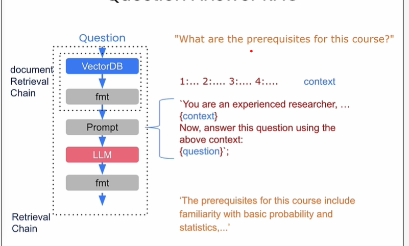
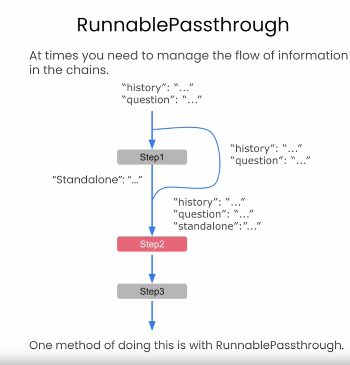
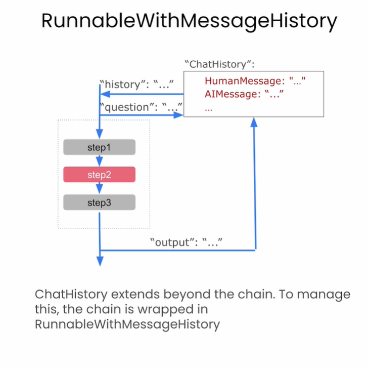

# Building Blocks

<head>Language Model</head>
<ol>
    <li> Text LLMs: Fn (string) -> string.
    <li> Chat models: list of messages -> single message output.
</ol>

<head> Prompt Template
<ol>
    <li> We can create Prompt Template using <b>ChatPromptTemplate.</b>
    <li> LangChain Expression Langauge (LCEL).
    <li> Output Parser - Convert Response JSON to String.
    <li> Runnable Sequence - Create sequence to be executed.
    <li> Streaming - Get the response few characters at a time.
    <li> Batch - Run model against batch of inputs at a time.
</ol>

# Data Loaders

<head> Loading
<ol>
    <li> Import Loader: GithubRepoLoader.
    <li> Create Loader: new GithubRepoLoader.
    <li> Load the Data: loader.load().
</ol>

<head> Splitting
<ol>
    <li> Import Splitter.
    <li> Create Splitter, provide chunkSize: Split size, chunkOverlap: How split overlap eachother.
    <li> Call splitText(String).
    <li> Call splitDocuments(loadeDocument).
 </ol>

# Vector Stores

<head> Create Vector Embedding 
<ol>
    <li> Import OpenAI Embedding (e.g. OpenAI Embedding)
    <li> Call constructor for Embedding Library
</ol>

<head> Create Vector Store
<ol>
    <li> Import Vector Store Library (e.g. langchain/vectorstores/memory)
    <li> Call constructor with Vector Embedding  
</ol>

<head> Load Data into Vector Store and create retriever
<ol>
    <li> Use Loader (e.g. PDFLoader)
    <li> Split the Document using Spliter
    <li> Call addDocuments on vectoreStore to load Doc Splits
    <li> Call asRetriever() on vectorStore to get vectorRetriever
</ol>

# Questions and Answers

<head> Document retrieval in Chain
<ol>
    <li> Extract Question from Query
    <li> Retrieve Documents in Chunks related to Question
    <li> Convert Retrieved Chunks into Context
</ol>

<head> Augmented Generation
<ol>
    <li> Create Answer Generation Template with "context" and "question".
    <li> Contruct Retrieval Chain (Runnable Seq) of using following format:   (Context + Question) -> (Template) -> (Model) -> StringOutputParser
    <li> Invoke Retrival Chain with User Query (e.g. { question: "blah blah blah!"})
    <li> Follow up doesn't work in this chain
</ol>

<head> Simple Flow with No History 
<ul>
    <li> Question is Input
    <li> Que goes through Document Retrieval Chain and then passed to the Prompt.
    <li> LLM Generates the answer based on prompt.
</ul>

<head> Runnable Passthrough 
<ul>
    <li> Runnable Passthrough sets the extra property to its input.
    <li> As seen in the image it takes {question: "", history: ""} and adds {standalone: ""} to the input.
</ul>

<head> Runnable With Message History
<ul>
    <li> ChatHistory: central storage for storing chat history
    <li> History is injected into Runnable
    <li> Question is injected as HumanMessage into history
    <li> Output is stored as AIMessage into history
</ul>

